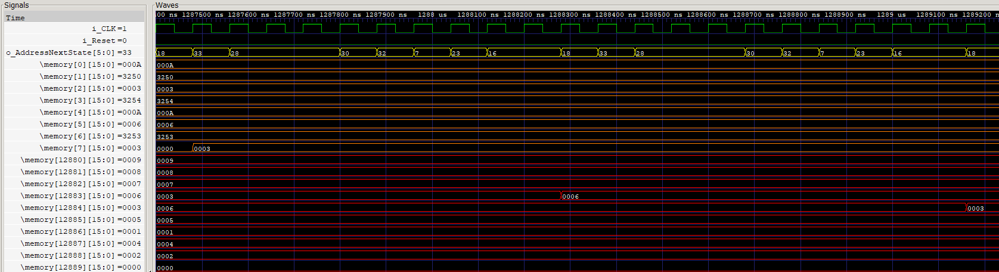

# LC-3 CPU Implementation in Verilog HDL

## Project Overview

This project is an accurate implementation of the Little Computer 3 (LC-3) Instruction Set Architecture (ISA) and Microarchitecture, as described in the textbook *Introduction to Computing Systems: From Bits and Gates to C/C++ & Beyond, Third Edition* by Yale Patt. To create this project I primarily used the LC-3 Finite State Machine (FSM) and Datapath I learned about in Dr. Patt's ECE 306 class at UT Austin. This Verilog implementation demonstrates the core aspects and instructions of the LC-3 CPU design, excluding interrupt and exception control (which will hopefully be added in the future). This project also demonstrates how LC-3 Assembly programs can be run on the LC-3 through an example sorting algorithm.

## Features

- **Supported Instructions**:
  - Arithmetic Operations: ADD, AND, NOT
  - Load/Store Operations: LD, LDI, LDR, LEA, ST, STI, STR
  - Control Operations: BR, JMP, JSR, JSRR, RET
  - Currently Missing: RTI, TRAP, Reserved
- **Core Functionality**: The project includes a fully functional (and textbook accurate) data path and control logic, with key components such as the ALU, Register File, Control Store, and Microsequencer. The design covers the essential ISA operations of the LC-3, meaning that all LC-3 Assembly programs without RTI and TRAP instructions can be run on this implementation. This is demonstrated by running a simple sorting algorithm to sort 2's compliment values in descending order.

## Example Program

In the Programs directory, I included a LC-3 Assembly program that sorts 2's compliment numbers into descending order. This program can be used to demonstrate the functionality of the LC-3 I've implemented.

Memory values being sorted into descending order:

> The green traces are clock and reset lines, orange traces are register values, and the red traces are the memory values being sorted.

A store (STR) instruction moving two number, 6 and 3, into their sorted order:

> Red traces are memory values, and the yellow trace, `o_addressNextState`, is the next state of the FSM to be executed. Additionally, by referring to the [LC-3's FSM](docs/LC3_State_Machine.pdf), it can be seen that the state transitions from 18, 33, 28, 30, 32, 7, 23, and to 16 are the correct state transitions to execute the STR instruction.

## Challenges

**1. Understanding the Microarchitecture:**
   The most significant challenge of this project was fully understanding the LC-3 microarchitecture, particularly the interaction between the control store and the register file. This was a gap in my prior knowledge from Dr. Patt’s ECE 306 class, so I spent time understanding how clocked components like the control store and register file synchronized to perform operations within a single clock cycle. A key realization was that while writes to the register file are clocked, reads are not, allowing for asynchronous access. This insight was crucial for implementing instructions such as `R1 <- R1 + 1` in one clock cycle.

**2. Correct Implementation of the LC-3:**
   Implementing the LC-3 required breaking down the datapath into submodules, testing them individually, and then integrating them. This process, while conceptually straightforward, was a valuable exercise in developing testbenches and debugging with waveform viewers.

## Project Structure

- **`src/`**:
  - **`datapath.v`**: Top Module that implements all submodules of the LC-3.
  - **`datapath_tb.v`**: Simple Testbench used to simulate the LC-3 processing of an LC-3 Assembly program.
  - **`control_logic.v`**: Handles the control signals and state transitions based on the LC-3 ISA.
- **`ControlSignals/`**:
  - **`ControlStore.csv`**: Contains control signals (in an easy to edit format) for each state implemented thus far.
  - **`convert.py`**: Converts `ControlStore.csv` into binary format so it can be put into the Control Store's memory.
- **`Programs/`**:
  - **`AssemblySortingAlgorithm.mem`**: Simple algorithm to sort 2's compliment values in descending order.
  - **`SimpleAssembler.py`**: Rudimentary assembler that I used to convert during testing.
- **`sim/`**: Old testbenches used to verify the functionality of submodules.
- **`docs/`**: Relevant documentation and images (ISA, Data Path, FSM).

## Simulating the LC-3

### Prerequisites

- **Simulator:** [APIO](https://github.com/FPGAwars/apio) (free and open source).
- **Waveform Viewer:** [GTKWave](https://gtkwave.sourceforge.net/) (can be installed by APIO).
- **Note**: Any Verilog simulator and waveform viewer should work, the above are what I used for this project.

### Installation and Simulation

1. Clone the repository:

   ```bash
   git clone https://github.com/MatthewKing2/LC3-CPU.git
   cd LC3-CPU
   ```

2. Simulate using the `datapath_tb.v` testbench:

   ```bash
   apio sim --project-dir src/
   ```

3. Open GTKWave to view the LC-3 running the sorting algorithm.

## Future Work

In the future, I plan to extend this project by incorporating interrupt and exception handling into the LC-3 architecture. This will involve adding the necessary hardware to the datapath to support these features and implementing the OS interrupt service routines within the LC-3's memory. With these additions, the LC-3 will be able to handle service routines such as PUSH and POP from the stack, as well as keyboard input and display output. Furthermore, I aim to enhance the keyboard input and display output subroutines by adding hardware that will allow the LC-3 to be deployed on an FPGA, enabling it to receive UART signals from an external keyboard and send display characters over UART to a computer. To fully realize this FPGA implementation, I will also need to interface external memory, as the FPGA I have lacks sufficient block RAM to support the LC-3's memory size.

## References

- Patt, Yale N., and Patel, Sanjay J. *Introduction to Computing Systems: From Bits & Gates to C/C++ and Beyond.* McGraw-Hill Education, 3rd edition.

## Contact Information

Feel free to reach me at [matthewjesseking@gmail.com](mailto:matthewjesseking@gmail.com) and/or connect with me on [LinkedIn](https://www.linkedin.com/in/matthew-king-ut/).

---
